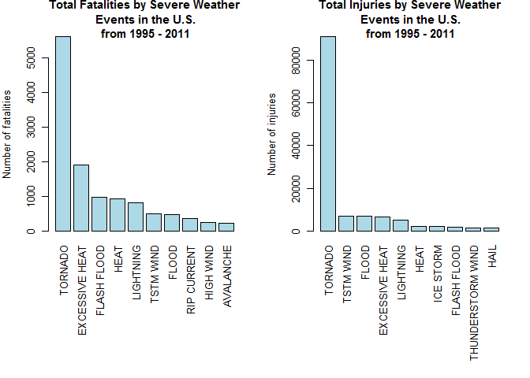
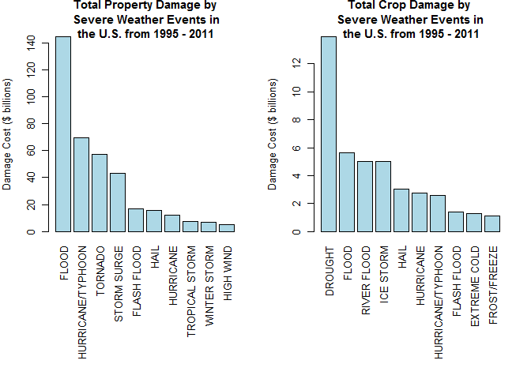

#Reproducible Research: Peer assessment 2

#Impact of Storms and other severe weather events on Public Health and Economy in the United States

##Synonpsis
In this report, we aim to analyze the impact of Storms and different weather events on public health and economy based on the U.S. National Oceanic and Atmospheric Administration's (NOAA) storm database. This database tracks characteristics of major storms and weather events in the United States, including when and where they occur, as well as estimates of any fatalities, injuries, and property damage. 

The database covers the time period between 1950 and November 2011. In the earlier years of the database there are generally fewer events recorded, most likely due to a lack of good records. More recent years should be considered more complete.

### Set the Global options
Throughout this report when writing code chunks in the R markdown document, always use echo = TRUE so that someone else will be able to read the code.

```r
knitr::opts_chunk$set(echo = TRUE)
```

###1. Load required libraries

```r
library(ggplot2)
library(plyr)
require(gridExtra)
```

```
## Loading required package: gridExtra
```

###2. Data Processing 
2.1 Code for reading in the dataset and/or processing the data

2.1.a reading in the dataset

```r
storm_all <- read.csv("C:/Data Science/05. Reproducible Research/Data/repdata%2Fdata%2FStormData.csv", sep = ",")
```

2.1.b sample of the dataset

```r
head(storm_all)
```

```
##   STATE__           BGN_DATE BGN_TIME TIME_ZONE COUNTY COUNTYNAME STATE
## 1       1  4/18/1950 0:00:00     0130       CST     97     MOBILE    AL
## 2       1  4/18/1950 0:00:00     0145       CST      3    BALDWIN    AL
## 3       1  2/20/1951 0:00:00     1600       CST     57    FAYETTE    AL
## 4       1   6/8/1951 0:00:00     0900       CST     89    MADISON    AL
## 5       1 11/15/1951 0:00:00     1500       CST     43    CULLMAN    AL
## 6       1 11/15/1951 0:00:00     2000       CST     77 LAUDERDALE    AL
##    EVTYPE BGN_RANGE BGN_AZI BGN_LOCATI END_DATE END_TIME COUNTY_END
## 1 TORNADO         0                                               0
## 2 TORNADO         0                                               0
## 3 TORNADO         0                                               0
## 4 TORNADO         0                                               0
## 5 TORNADO         0                                               0
## 6 TORNADO         0                                               0
##   COUNTYENDN END_RANGE END_AZI END_LOCATI LENGTH WIDTH F MAG FATALITIES
## 1         NA         0                      14.0   100 3   0          0
## 2         NA         0                       2.0   150 2   0          0
## 3         NA         0                       0.1   123 2   0          0
## 4         NA         0                       0.0   100 2   0          0
## 5         NA         0                       0.0   150 2   0          0
## 6         NA         0                       1.5   177 2   0          0
##   INJURIES PROPDMG PROPDMGEXP CROPDMG CROPDMGEXP WFO STATEOFFIC ZONENAMES
## 1       15    25.0          K       0                                    
## 2        0     2.5          K       0                                    
## 3        2    25.0          K       0                                    
## 4        2     2.5          K       0                                    
## 5        2     2.5          K       0                                    
## 6        6     2.5          K       0                                    
##   LATITUDE LONGITUDE LATITUDE_E LONGITUDE_ REMARKS REFNUM
## 1     3040      8812       3051       8806              1
## 2     3042      8755          0          0              2
## 3     3340      8742          0          0              3
## 4     3458      8626          0          0              4
## 5     3412      8642          0          0              5
## 6     3450      8748          0          0              6
```

2.2 Extracting the required data

Since this analysis focuses only on the public health and economic consequences of severe weather events, therefore a subset of the database is needed.

```r
event <- c("EVTYPE", "FATALITIES", "INJURIES", "PROPDMG", "PROPDMGEXP","CROPDMG", "CROPDMGEXP")
		
storm <- storm_all[event]
```
sample of the required dataset

```r
head(storm)
```

```
##    EVTYPE FATALITIES INJURIES PROPDMG PROPDMGEXP CROPDMG CROPDMGEXP
## 1 TORNADO          0       15    25.0          K       0           
## 2 TORNADO          0        0     2.5          K       0           
## 3 TORNADO          0        2    25.0          K       0           
## 4 TORNADO          0        2     2.5          K       0           
## 5 TORNADO          0        2     2.5          K       0           
## 6 TORNADO          0        6     2.5          K       0
```

2.3 Finding property damage

Property damage exponents for each level was listed out and assigned those values for the property exponent data. Invalid data was excluded by assigning the value as '0'. Then property damage value was calculated by multiplying the property damage and property exponent value. The code for this process was listed below
	
2.3.1 Finding the property damage exponent and levels

```r
unique(storm$PROPDMGEXP)
```

```
##  [1] K M   B m + 0 5 6 ? 4 2 3 h 7 H - 1 8
## Levels:  - ? + 0 1 2 3 4 5 6 7 8 B h H K m M
```
		
2.3.2 Assigning values for the property exponent data 

```r
storm$PROPEXP[storm$PROPDMGEXP == "K"] <- 1000
storm$PROPEXP[storm$PROPDMGEXP == "M"] <- 1e+06
storm$PROPEXP[storm$PROPDMGEXP == ""] <- 1
storm$PROPEXP[storm$PROPDMGEXP == "B"] <- 1e+09
storm$PROPEXP[storm$PROPDMGEXP == "m"] <- 1e+06
storm$PROPEXP[storm$PROPDMGEXP == "0"] <- 1
storm$PROPEXP[storm$PROPDMGEXP == "5"] <- 1e+05
storm$PROPEXP[storm$PROPDMGEXP == "6"] <- 1e+06
storm$PROPEXP[storm$PROPDMGEXP == "4"] <- 10000
storm$PROPEXP[storm$PROPDMGEXP == "2"] <- 100
storm$PROPEXP[storm$PROPDMGEXP == "3"] <- 1000
storm$PROPEXP[storm$PROPDMGEXP == "h"] <- 100
storm$PROPEXP[storm$PROPDMGEXP == "7"] <- 1e+07
storm$PROPEXP[storm$PROPDMGEXP == "H"] <- 100
storm$PROPEXP[storm$PROPDMGEXP == "1"] <- 10
storm$PROPEXP[storm$PROPDMGEXP == "8"] <- 1e+08
```

2.3.3 Assigning '0' to invalid exponent data

```r
storm$PROPEXP[storm$PROPDMGEXP == "+"] <- 0
storm$PROPEXP[storm$PROPDMGEXP == "-"] <- 0
storm$PROPEXP[storm$PROPDMGEXP == "?"] <- 0
```

2.3.4 Calculating the property damage value

```r
storm$PROPDMGVAL <- storm$PROPDMG * storm$PROPEXP
```
 
2.4 Finding crop damage

Crop damage exponents for each level was listed out and assigned those values for the crop exponent data. Invalid data was excluded by assigning the value as '0'. Then crop damage value was calculated by multiplying the crop damage and crop exponent value. The code for this process was listed below

2.4.1 Finding the crop damage exponent and levels

```r
unique(storm$CROPDMGEXP)
```

```
## [1]   M K m B ? 0 k 2
## Levels:  ? 0 2 B k K m M
```

2.4.2 Assigning values for the crop exponent data 

```r
storm$CROPEXP[storm$CROPDMGEXP == "M"] <- 1e+06
storm$CROPEXP[storm$CROPDMGEXP == "K"] <- 1000
storm$CROPEXP[storm$CROPDMGEXP == "m"] <- 1e+06
storm$CROPEXP[storm$CROPDMGEXP == "B"] <- 1e+09
storm$CROPEXP[storm$CROPDMGEXP == "0"] <- 1
storm$CROPEXP[storm$CROPDMGEXP == "k"] <- 1000
storm$CROPEXP[storm$CROPDMGEXP == "2"] <- 100
storm$CROPEXP[storm$CROPDMGEXP == ""] <- 1
```

2.4.3 Assigning '0' to invalid exponent data

```r
storm$CROPEXP[storm$CROPDMGEXP == "?"] <- 0
```

2.4.4 calculating the crop damage value

```r
storm$CROPDMGVAL <- storm$CROPDMG * storm$CROPEXP	
```

2.5 Finding totals of each incident by event type.

It was observed that "The most harmful to population health" events are fatalities and injuries. So, only those events with fatalities and injuries were selecetd.

It was observed that "The most harmful to econamic problem"" events are Property and crop damages. So, only those events with property and crop damage were selecetd.

Each incident (Fatalities,Injuries, Property damage and Crop damage), the total values were estimated. Code for which is as follows.


```r
fatal <- aggregate(FATALITIES ~ EVTYPE, storm, FUN = sum)
injury <- aggregate(INJURIES ~ EVTYPE, storm, FUN = sum)
propdmg <- aggregate(PROPDMGVAL ~ EVTYPE, storm, FUN = sum)
cropdmg <- aggregate(CROPDMGVAL ~ EVTYPE, storm, FUN = sum)
```

2.6 Plotting Top 10 events with highest fatalities and highest injuries.

Calculation and graph of the Highest fatalities and highest injuries for Top 10 events. 

2.6.1 Listing Top 10 events with highest fatalities

```r
fatal10 <- fatal[order(-fatal$FATALITIES), ][1:10, ]
```

2.6.2 Listing Top 10 events with highest injuries

```r
injury10 <- injury[order(-injury$INJURIES), ][1:10, ]
```

2.6.3 Graph plotting

```r
par(mfrow = c(1, 2), mar = c(12, 4, 3, 2), mgp = c(3, 1, 0), cex = 0.8)
barplot(fatal10$FATALITIES, las = 3, names.arg = fatal10$EVTYPE, main = "Total Fatalities by Severe Weather\n Events in the U.S.\n from 1995 - 2011", ylab = "Number of fatalities", col = "light blue")
barplot(injury10$INJURIES, las = 3, names.arg = injury10$EVTYPE, main = "Total Injuries by Severe Weather\n Events in the U.S.\n from 1995 - 2011", ylab = "Number of injuries", col = "light blue")	
```

<!-- -->

2.7 Plotting Top 10 events with highest Property damage and highest crop damage.

Calculation of the Highest Property damage and highest crop damage for Top 10 events. Graph to show the Highest Property damage and highest crop damage for Top 10 events.

2.7.1 Finding Top 10 events with highest property damage

```r
propdmg10 <- propdmg[order(-propdmg$PROPDMGVAL), ][1:10, ]
```

2.7.2 Finding Top 10 events with highest crop damage

```r
cropdmg10 <- cropdmg[order(-cropdmg$CROPDMGVAL), ][1:10, ]
```

2.7.3 Graph

```r
par(mfrow = c(1, 2), mar = c(12, 4, 3, 2), mgp = c(3, 1, 0), cex = 0.8)
barplot(propdmg10$PROPDMGVAL/(10^9), las = 3, names.arg = propdmg10$EVTYPE, main = "Total Property Damage by\n Severe Weather Events in\n the U.S. from 1995 - 2011", ylab = "Damage Cost ($ billions)",  col = "lightblue")
barplot(cropdmg10$CROPDMGVAL/(10^9), las = 3, names.arg = cropdmg10$EVTYPE, main = "Total Crop Damage by \nSevere Weather Events in\n the U.S. from 1995 - 2011", ylab = "Damage Cost ($ billions)", col = "lightblue")
```

<!-- -->

###3. Results Summary
Based on the data, **TORNADO** caused the maximum number of fatalities and injuries. It was followed by **EXCESSIVE HEAT** for fatalities and **TSTM WIND** for injuries.

**FLOOD** caused the maximum property damage; **DROUGHT** caused the maximum crop damage.  **HURRICANE/TYPHOON** caused the second maximum property damage; and **FLOOD** caused second maximum crop damage.		
